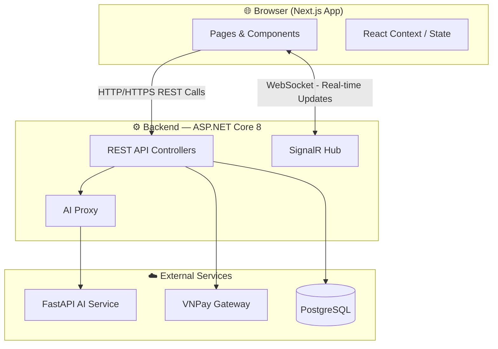
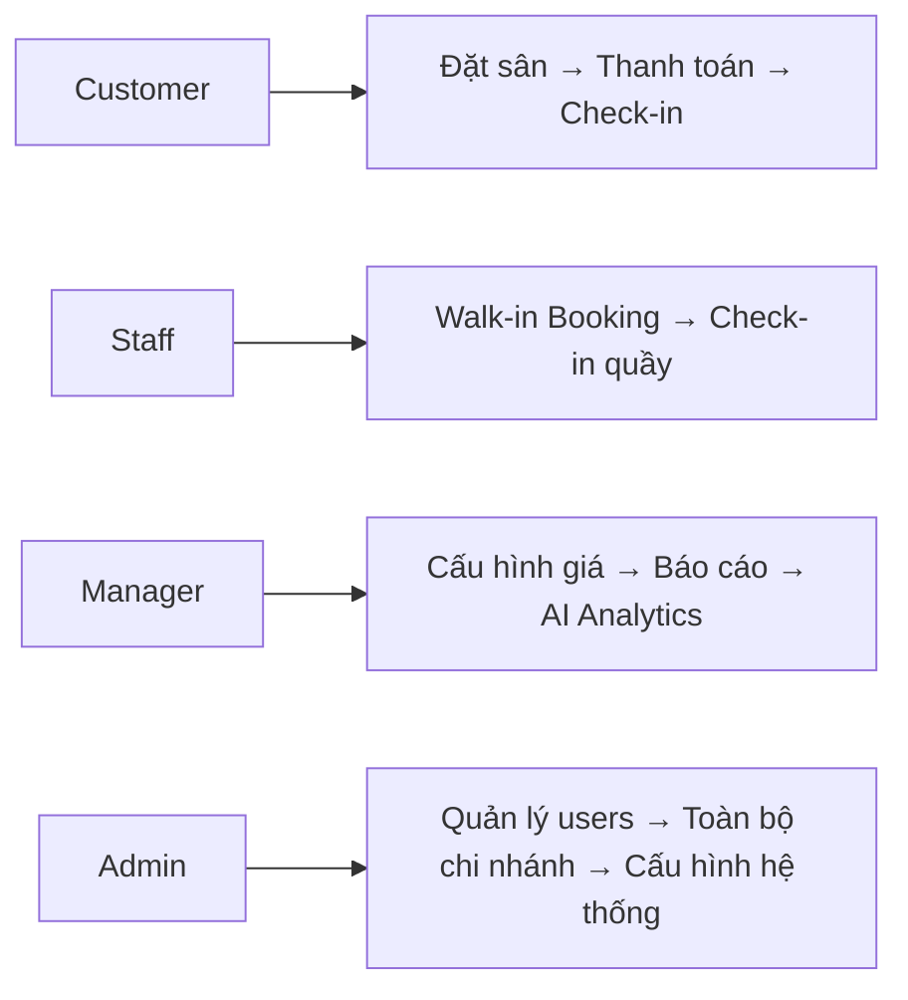
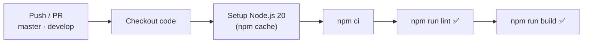

# SmashCourt — Frontend (FE) 🏸

[](https://nextjs.org/)
[](https://react.dev/)
[](https://tailwindcss.com/)
[](https://www.typescriptlang.org/)
[](https://opensource.org/licenses/MIT)
[](https://github.com/NguyenThanhTrung-N2T/SmashCourt-FE/actions)

> Giao diện người dùng hiện đại, tối ưu hiệu năng và phản hồi thời gian thực của Hệ thống Quản lý và Đặt Sân Cầu Lông **SmashCourt**. Được xây dựng trên nền tảng **Next.js 16 (App Router)** và **React 19**, mang lại trải nghiệm mượt mà, phân quyền rõ ràng cho Khách hàng, Nhân viên, Quản lý và Quản trị viên.

---

## 🌐 Hệ sinh thái dự án (Project Ecosystem)

SmashCourt được chia làm **3 phân hệ độc lập**, mỗi phân hệ là một repository riêng để tối ưu hóa khả năng phát triển song song và triển khai độc lập:

| Phân hệ | Công nghệ | Repository |
| :--- | :--- | :--- |
| 🖥️ **Frontend (FE)** ← *Bạn đang ở đây* | Next.js 16, React 19, TailwindCSS v4 | [SmashCourt-FE](https://github.com/NguyenThanhTrung-N2T/SmashCourt-FE) |
| ⚙️ **Backend (BE)** | ASP.NET Core 8, SignalR, Hangfire, PostgreSQL | [SmashCourt-BE](https://github.com/NguyenThanhTrung-N2T/SmashCourt-BE) |
| 🤖 **AI Service** | FastAPI, Python 3.12, Google Gemini API | [SmashCourt-AI](https://github.com/NguyenThanhTrung-N2T/SmashCourt-AI) |

---

## 📌 Giới thiệu (Introduction)

**SmashCourt Frontend** là cổng giao tiếp chính giữa người dùng và toàn bộ hệ sinh thái SmashCourt. Ứng dụng xử lý các nghiệp vụ phức tạp ngay trên giao diện người dùng với độ mượt mà và nhất quán cao:

- **Next.js App Router**: Kết hợp linh hoạt Server Components và Client Components, tối ưu hóa SEO, giảm thời gian phản hồi trang đầu (TTFB) và cải thiện Core Web Vitals.
- **Real-time với SignalR**: Mọi thay đổi trạng thái sân cầu (booked, locked, available) được cập nhật ngay lập tức trên Time Grid mà không cần refresh trang.
- **Role-based UI**: Giao diện và luồng nghiệp vụ được thiết kế riêng biệt cho 4 nhóm người dùng: **Customer**, **Staff**, **Branch Manager**, **System Admin**.
- **Responsive Design**: Tương thích hoàn hảo trên mọi thiết bị — Mobile, Tablet, Desktop.

---

## 🚀 Tính năng cốt lõi (Key Features)

### 👤 Khách hàng (Customer)
| Tính năng | Mô tả |
| :--- | :--- |
| **Time Grid Real-time** | Lưới đặt sân theo giờ với cập nhật trạng thái tức thời qua SignalR. Slot bị khóa tạm trong quá trình thanh toán để tránh double-booking. |
| **Đặt sân & Thanh toán** | Luồng đặt sân đầy đủ — chọn sân, chọn dịch vụ kèm, xem giá tổng, thanh toán online qua VNPay. |
| **Hủy sân có hoàn tiền** | Hỗ trợ hủy booking với chính sách hoàn tiền linh hoạt theo thời gian hủy. |
| **Chương trình Loyalty** | Xem tích lũy điểm thành viên (Bronze → Silver → Gold → Platinum), lịch sử giao dịch và mức ưu đãi tương ứng. |
| **AI Chatbot & Gợi ý** | Chat với trợ lý AI để được tư vấn dịch vụ (FAQ) và nhận gợi ý sân/khung giờ tối ưu theo lịch sử đặt sân cá nhân. |

### 🧑‍💼 Nhân viên & Quản lý (Staff & Manager)
| Tính năng | Mô tả |
| :--- | :--- |
| **Đặt sân offline** | Tạo booking nhanh cho khách hàng vãng lai (walk-in) tại quầy. |
| **Check-in nhanh** | Xác nhận check-in khách theo mã booking. |
| **Cấu hình giá sân** | Override giá sân linh hoạt theo chi nhánh, khung giờ (Peak/Off-peak), loại ngày (Weekday/Weekend). |
| **Báo cáo & Analytics** | Biểu đồ doanh thu, tỉ lệ lấp đầy (occupancy rate), phân tích hủy booking với dữ liệu do AI tổng hợp. |
| **Quản lý khuyến mãi** | Tạo, cấu hình và theo dõi hiệu quả các chương trình khuyến mãi theo chi nhánh. |

---

## 📐 Kiến trúc tổng quan (Overall Architecture)

### Luồng dữ liệu hệ thống



### Phân quyền và luồng nghiệp vụ theo vai trò



---

## 🛠️ Hướng dẫn cài đặt (Installation)

### Yêu cầu hệ thống (Prerequisites)

| Công cụ | Phiên bản tối thiểu | Ghi chú |
| :--- | :--- | :--- |
| [Node.js](https://nodejs.org/) | `20.x` trở lên | Khuyến nghị LTS |
| npm | `10.x` trở lên | Đi kèm Node.js |
| [Git](https://git-scm.com/) | Bất kỳ | Để clone dự án |

### Clone và cài đặt

```bash
# 1. Clone repository
git clone https://github.com/NguyenThanhTrung-N2T/SmashCourt-FE.git

# 2. Di chuyển vào thư mục dự án
cd SmashCourt-FE

# 3. Cài đặt tất cả gói phụ thuộc
npm install
```

---

## ▶️ Khởi chạy dự án (Running the Project)

### Development Server (Local)

```bash
npm run dev
```

> Truy cập ứng dụng tại: **[http://localhost:3000](http://localhost:3000)**

### Production Build

```bash
# Biên dịch và tối ưu hóa cho production
npm run build

# Khởi chạy ứng dụng production
npm start
```

### Kiểm tra chất lượng mã (Linting)

```bash
npm run lint
```

### Khởi chạy với Docker Compose

```bash
docker compose up -d --build
```

> 💡 Docker image sử dụng **multi-stage build**: giai đoạn build với Node.js đầy đủ, giai đoạn runtime chỉ copy `.next/standalone` vào image siêu gọn nhẹ để giảm kích thước và tăng bảo mật.

---

## ⚙️ Cấu hình môi trường (Env Configuration)

```bash
# Sao chép file mẫu
cp .env.example .env
```

Sau đó mở file `.env` và điền các giá trị phù hợp:

```env
# Backend API
NEXT_PUBLIC_API_URL=http://localhost:5000

# SignalR Hub (real-time connection)
NEXT_PUBLIC_HUB_URL=http://localhost:5000/hubs
```

Bảng mô tả chi tiết các biến môi trường:

| Biến | Bắt buộc | Mô tả |
| :--- | :---: | :--- |
| `NEXT_PUBLIC_API_URL` | ✅ | Địa chỉ gốc của REST API Backend |
| `NEXT_PUBLIC_HUB_URL` | ✅ | Địa chỉ SignalR Hub để nhận cập nhật real-time |

> ⚠️ **Lưu ý bảo mật**: Các biến `NEXT_PUBLIC_*` sẽ được nhúng vào bundle phía client. **Tuyệt đối không** đặt API key bí mật hoặc thông tin nhạy cảm vào đây.

---

## 📂 Cấu trúc thư mục (Folder Structure)

Dự án tuân theo mô hình **Feature-Driven** kết hợp **Next.js App Router**, giúp phân tách rõ ràng giữa các vai trò người dùng và module tính năng:

```
SmashCourt-FE/
│
├── app/                           # Next.js App Router — Routing & Pages
│   ├── (customer)/                # Route group — Giao diện Khách hàng
│   ├── auth/                      # Đăng nhập, Đăng ký, OTP, Quên mật khẩu
│   ├── booking/                   # Luồng đặt sân và thanh toán VNPay
│   ├── cancellation-policy/       # Trang hiển thị chính sách hủy sân
│   ├── employee/                  # Giao diện quản lý nhân viên (System Admin)
│   ├── manager/                   # Giao diện quản lý chi nhánh
│   ├── owner/                     # Giao diện Admin toàn hệ thống
│   ├── staff/                     # Giao diện nhân viên tại quầy
│   ├── globals.css                # Global styles & TailwindCSS v4 config
│   ├── layout.tsx                 # Root Layout — Provider, Font, Metadata
│   └── page.tsx                   # Trang chủ (redirect/landing)
│
├── src/
│   ├── api/                       # API layer — Fetch wrappers, endpoint config
│   ├── contexts/                  # React Contexts (Auth, SignalR, Toast...)
│   ├── features/                  # Modules theo tính năng
│   │   ├── booking/               # Components & logic đặt sân
│   │   ├── dashboard/             # Dashboard & báo cáo
│   │   ├── chat/                  # AI Chatbot interface
│   │   └── ...                    # Các module khác
│   ├── layouts/                   # Layout dùng chung (Sidebar, Header, Footer)
│   ├── lib/                       # Khởi tạo thư viện bên thứ ba
│   ├── scripts/                   # Utility scripts
│   └── shared/                    # Components, hooks, utils & types dùng chung
│
├── public/                        # Static assets (images, icons, fonts)
├── .github/workflows/ci.yml       # GitHub Actions CI pipeline
├── Dockerfile                     # Multi-stage Docker build
├── docker-compose.yml             # Docker Compose config
├── next.config.ts                 # Next.js configuration
├── tsconfig.json                  # TypeScript compiler config
└── package.json                   # Dependencies & npm scripts
```

---

## ⚡ CI/CD (GitHub Actions)

Pipeline tự động hóa kiểm định chất lượng mã được định nghĩa trong [`.github/workflows/ci.yml`](https://github.com/NguyenThanhTrung-N2T/SmashCourt-FE/blob/master/.github/workflows/ci.yml):



| Bước | Lệnh | Mục đích |
| :--- | :--- | :--- |
| Install | `npm ci` | Cài đặt chính xác phiên bản từ `package-lock.json` |
| Lint | `npm run lint` | Kiểm tra cú pháp, anti-patterns với ESLint |
| Build | `npm run build` | Kiểm chứng TypeScript compile và Next.js bundle thành công |

---

## 🤝 Hướng dẫn đóng góp (Contribution Guidelines)

Chúng tôi trân trọng và chào đón mọi đóng góp từ cộng đồng! Vui lòng tuân thủ quy trình sau:

1. **Fork** repository về tài khoản cá nhân.
2. **Tạo nhánh** từ `develop` với quy ước đặt tên rõ ràng:
   ```bash
   git checkout -b feature/your-feature-name
   # hoặc
   git checkout -b fix/bug-description
   ```
3. **Viết code** đảm bảo:
   - Tuân thủ ESLint ruleset của dự án (`npm run lint` phải pass).
   - TypeScript strict mode — không dùng `any` tùy tiện.
   - Đặt tên component, hook, function theo chuẩn PascalCase/camelCase nhất quán.
4. **Commit** theo chuẩn [Conventional Commits](https://www.conventionalcommits.org/):
   ```bash
   git commit -m "feat: add slot interest notification badge"
   git commit -m "fix: resolve time grid flicker on SignalR reconnect"
   ```
5. **Push** và tạo **Pull Request** đến nhánh `develop`:
   - Mô tả rõ ràng các thay đổi và lý do.
   - Đính kèm screenshot/video nếu thay đổi liên quan đến UI.

---

## 🗺️ Lộ trình phát triển (Roadmap)

| Trạng thái | Tính năng |
| :---: | :--- |
| ✅ Done | Tích hợp TailwindCSS v4 và Design System cơ bản |
| ✅ Done | Time Grid real-time qua SignalR |
| ✅ Done | Luồng đặt sân & thanh toán VNPay đầy đủ |
| ✅ Done | Phân quyền UI theo 4 nhóm người dùng |
| ✅ Done | Tích hợp AI Chatbot FAQ & gợi ý đặt sân |
| 🔄 In Progress | Tối ưu hóa hiệu năng (Lazy loading, Code splitting) |
| 📋 Planned | PWA — Progressive Web App cho trải nghiệm mobile |
| 📋 Planned | Dashboard Analytics nâng cao với nhiều loại biểu đồ |
| 📋 Planned | Notification center tổng hợp thông báo trong app |

---

## 📄 Giấy phép (License)

Phát hành dưới giấy phép **MIT License** — cho phép tự do sử dụng, sao chép, sửa đổi và phân phối cho cả mục đích cá nhân lẫn thương mại.

```text
MIT License

Copyright (c) 2026 Nguyen Thanh Trung — SmashCourt

Permission is hereby granted, free of charge, to any person obtaining a copy
of this software and associated documentation files (the "Software"), to deal
in the Software without restriction, including without limitation the rights
to use, copy, modify, merge, publish, distribute, sublicense, and/or sell
copies of the Software, and to permit persons to whom the Software is
furnished to do so, subject to the following conditions:

The above copyright notice and this permission notice shall be included in all
copies or substantial portions of the Software.

THE SOFTWARE IS PROVIDED "AS IS", WITHOUT WARRANTY OF ANY KIND, EXPRESS OR
IMPLIED, INCLUDING BUT NOT LIMITED TO THE WARRANTIES OF MERCHANTABILITY,
FITNESS FOR A PARTICULAR PURPOSE AND NONINFRINGEMENT.
```

Xem file [`LICENSE`](./LICENSE) hoặc tại [opensource.org/licenses/MIT](https://opensource.org/licenses/MIT).
